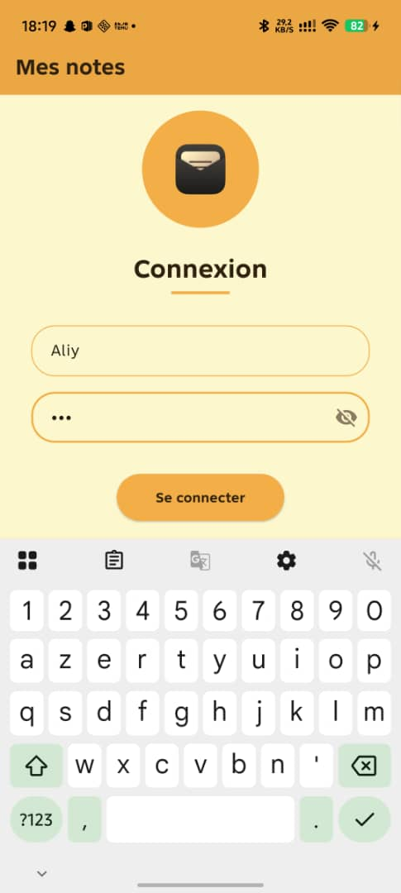
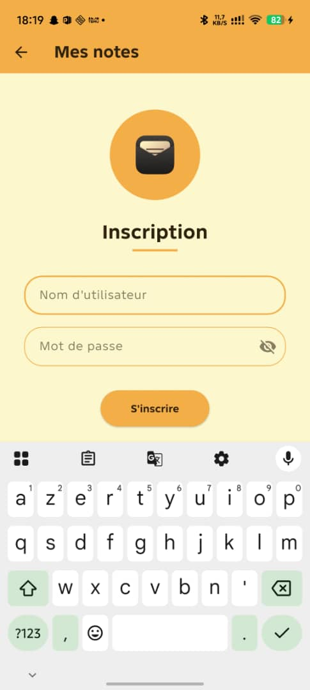
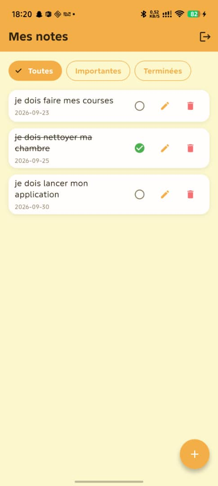
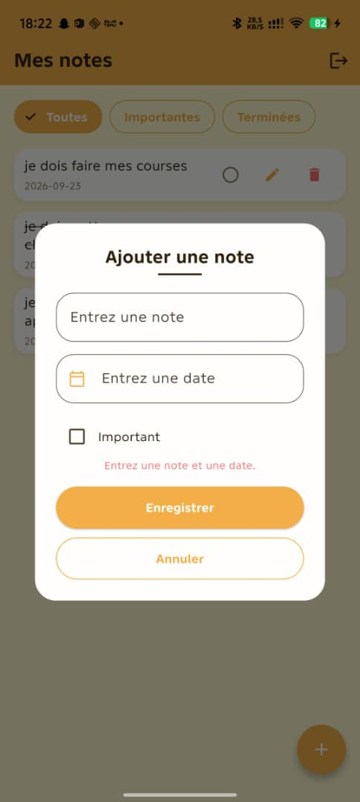
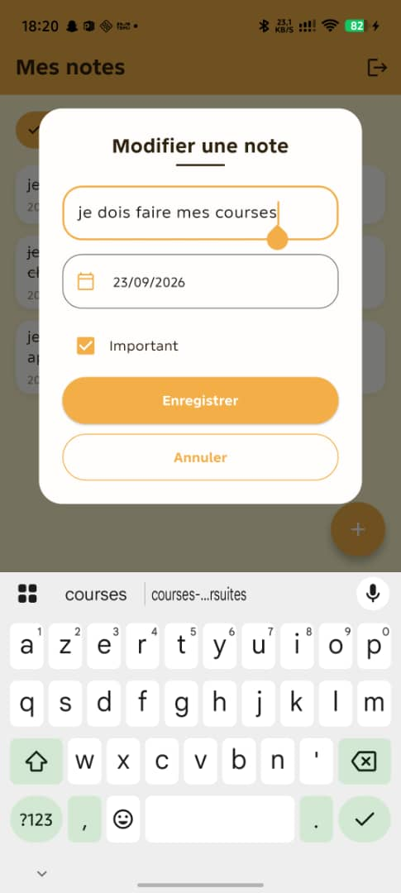
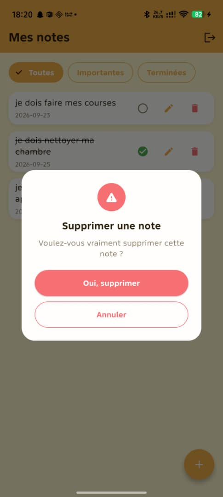
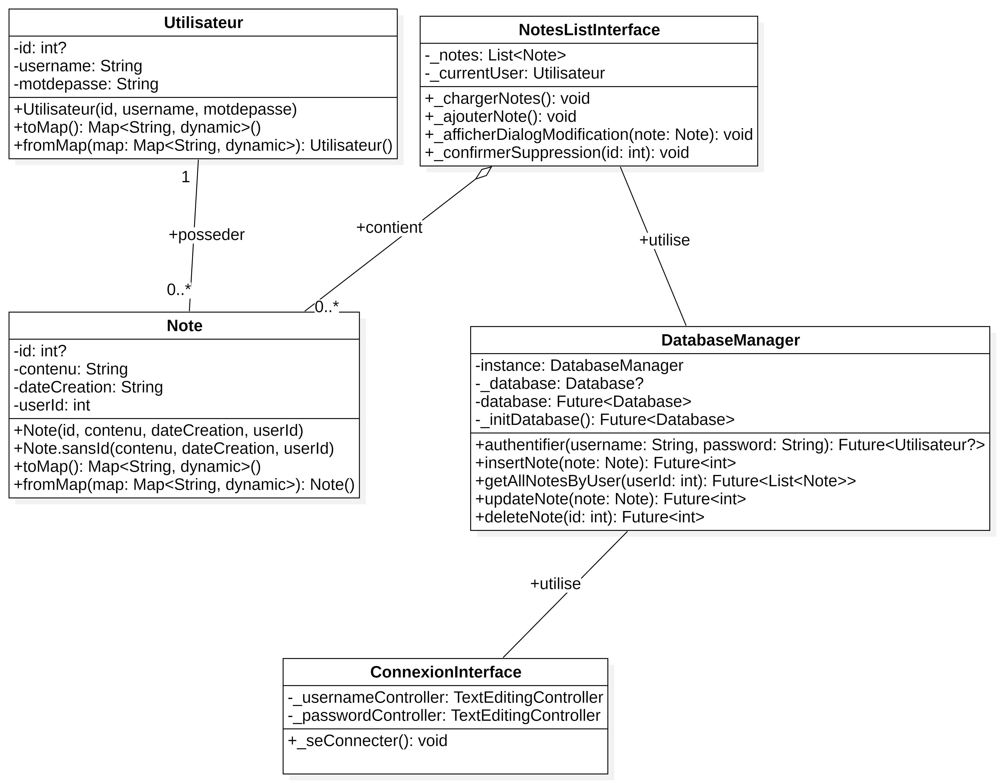

# Application de gestion de notes

Application de gestion de notes développée avec **Flutter** et une base de
données locale **SQLite** (via `sqflite`), réalisée dans le cadre du projet
Semaine 6 de la formation DCLIC.

## Captures d'écran

<p align="center">
  
  
  
  <br/>
  
  
  
</p>

## Diagramme de classes



## Installation

1. Installer Flutter (canal stable) : https://docs.flutter.dev/get-started/install
2. Récupérer le projet (dossiers `lib/`, `assets/` et fichier `pubspec.yaml`) :
   ```bash
   flutter create appnotes_dclic
   # puis remplacer le dossier lib/, le dossier assets/ et pubspec.yaml
   # générés par ceux fournis dans ce livrable
   ```
3. Installer les dépendances :
   ```bash
   flutter pub get
   ```
4. Lancer l'application sur un émulateur ou un appareil Android connecté :
   ```bash
   flutter run
   ```

## Fonctionnalités

- Inscription et connexion locales (sans serveur).
- Création, modification et suppression de notes (texte, date, importance).
- Marquage d'une note comme terminée.
- Filtrage des notes : Toutes / Importantes / Terminées.
- Déconnexion depuis l'écran principal.
- Messages d'erreur clairs à chaque étape (champs vides, identifiants
  incorrects, pseudo déjà pris, confirmation de suppression).
- Persistance complète via SQLite : les notes et les comptes restent
  disponibles après fermeture de l'application.

## Utilisation

| Écran | Action |
|---|---|
| **Connexion** | Saisir pseudo + mot de passe existants, ou suivre le lien « Pas encore de compte ? S'inscrire ». |
| **Inscription** | Créer un compte (pseudo unique + mot de passe), redirige automatiquement vers la liste des notes. |
| **Liste des notes** | Filtrer via les onglets, ajouter une note avec le bouton `+`, modifier via l'icône crayon, supprimer via l'icône corbeille, cocher le rond pour marquer une note terminée, se déconnecter via l'icône en haut à droite. |
| **Ajout / modification** | Renseigner le texte, choisir une date via le calendrier, cocher « Important » si besoin, puis Enregistrer. |
| **Suppression** | Confirmer ou annuler dans la boîte de dialogue avant suppression définitive. |

## Structure du projet

```
lib/
  main.dart                         Point d'entrée
  modele/
    note.dart                       Modèle de données Note
  services/
    database_helper.dart            Accès SQLite (utilisateurs + notes)
  views/
    couleurs.dart                   Palette reprise des maquettes Figma
    ecran_connexion.dart            Écran de connexion
    ecran_inscription.dart          Écran de création de compte
    ecran_liste_notes.dart          Écran principal (liste, filtres, FAB)
    carte_note.dart                 Carte de note (texte, date, actions)
    dialogue_note.dart              Modale d'ajout / modification
    dialogue_suppression.dart       Modale de confirmation de suppression
assets/
  images/
    icone_message.jpg               Icône des écrans de connexion/inscription
docs/
  diagramme_classes.jpg             Diagramme de classes
  screenshots/                      Captures d'écran
```

## Choix de conception

- **Base de données locale (SQLite via sqflite)** : deux tables, `users`
  (authentification) et `notes` (id, text, date, important, done). Aucune
  donnée ne quitte l'appareil — logique d'écoconception (pas de requêtes
  réseau, pas de serveur distant à maintenir).
- **Inscription séparée de la connexion** : un compte doit être créé
  explicitement (`DatabaseHelper.register`) ; la connexion ne fait que
  vérifier des identifiants existants, avec un message d'erreur générique
  volontairement peu précis (« pseudo ou mot de passe incorrect ») pour ne
  pas révéler si c'est le pseudo qui est inconnu ou le mot de passe qui est
  faux.
- **Icône de connexion** : `assets/images/icone_message.jpg` reprend
  l'icône exacte de la maquette Figma (pas une icône Material générée),
  affichée avec `BoxFit.contain` dans un cadre de taille fixe pour que ses
  proportions d'origine soient toujours respectées.
- **Bouton d'ajout rond** : le FAB force `shape: CircleBorder()` — Material
  3 utilise par défaut une forme arrondie non circulaire, qu'il faut donc
  spécifier explicitement pour obtenir un cercle parfait comme la maquette.

## Dépannage

**L'icône de connexion ne s'affiche pas / erreur `Unable to load asset`**
1. Vérifier que `pubspec.yaml` contient bien, sous la clé `flutter:` de
   premier niveau (pas sous `dependencies:`) :
   ```yaml
   flutter:
     uses-material-design: true
     assets:
       - assets/images/
   ```
2. Vérifier que le dossier est à la racine du projet, au même niveau que
   `lib/` et `pubspec.yaml` — pas à l'intérieur de `lib/`.
3. Vérifier le nom exact du fichier en terminal (`ls assets/images` sous
   Mac/Linux, `dir assets\images` sous Windows). Piège fréquent : Windows
   masque les extensions connues, un fichier renommé peut donc s'appeler
   en réalité `icone_message.jpg.jpg` sans que ça se voie dans
   l'explorateur.
4. Après toute modification de `pubspec.yaml` ou ajout d'un nouvel asset,
   un hot reload ne suffit pas : lancer `flutter pub get`, puis arrêter
   complètement l'application et refaire `flutter run` (pas seulement
   `r`/`R` dans le terminal).
5. En cas de doute persistant : `flutter clean` puis `flutter pub get` et
   relancer.

## Pistes d'amélioration futures

- Barre de recherche textuelle si le nombre de notes grandit.
- Affichage/masquage du mot de passe complété par un « mot de passe oublié »
  local (question de sécurité) si plusieurs comptes doivent coexister sur un
  même appareil.
- Rappels/notifications locales à l'approche de la date d'une note.

